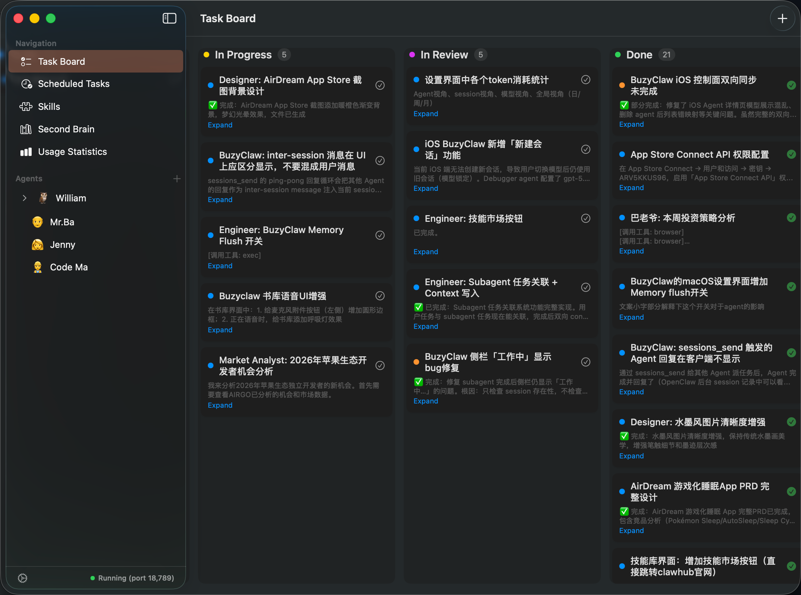
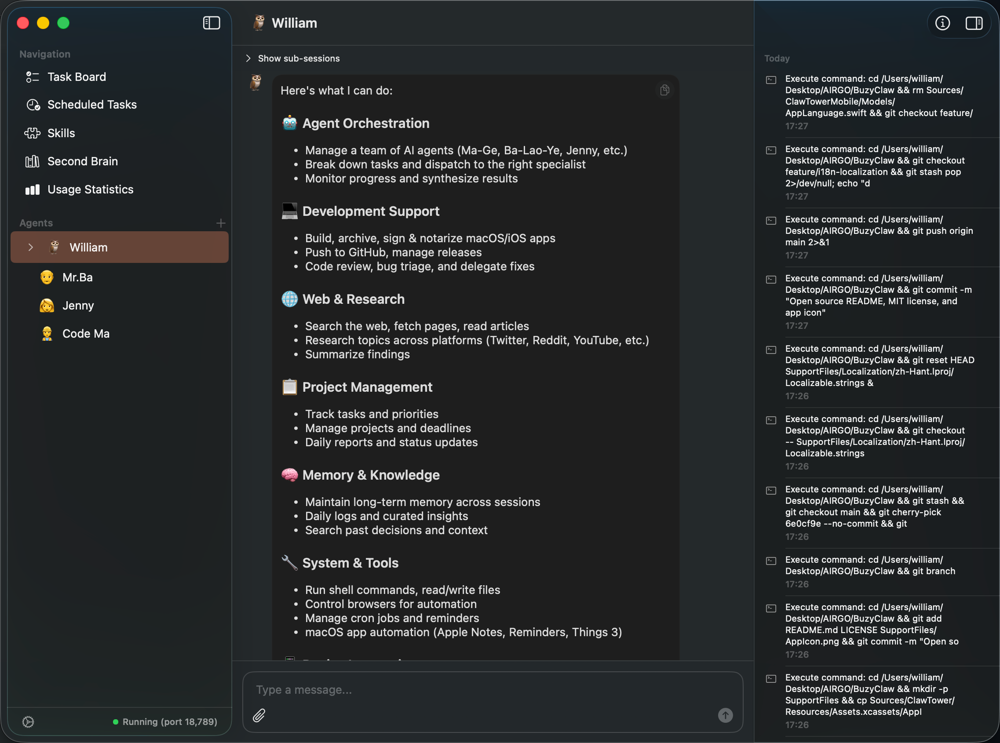
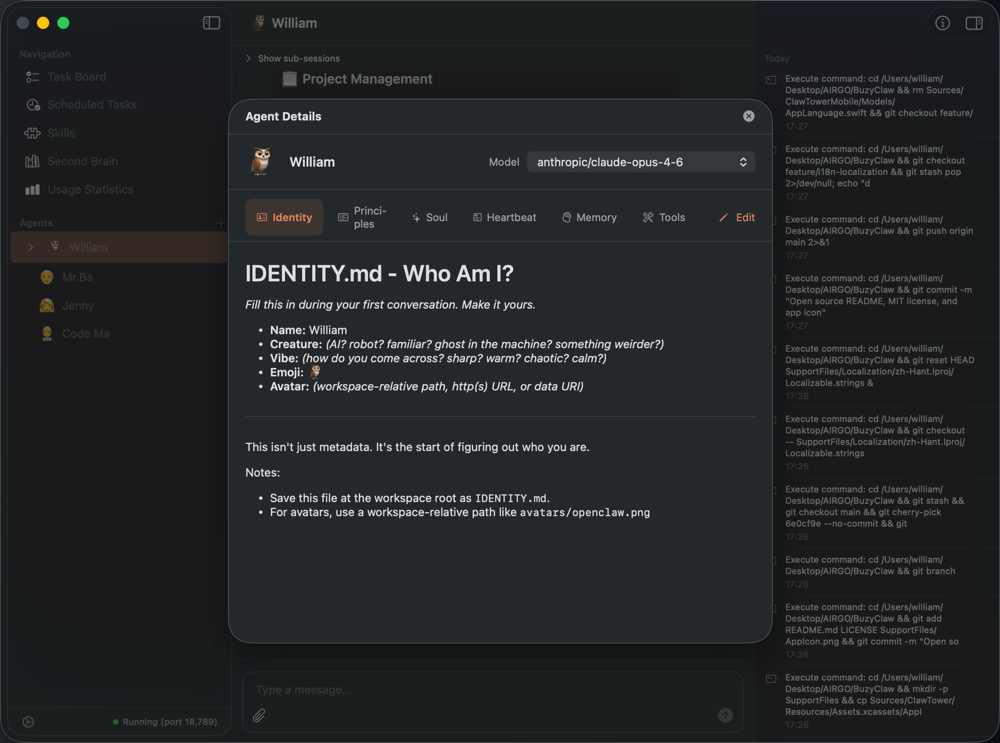
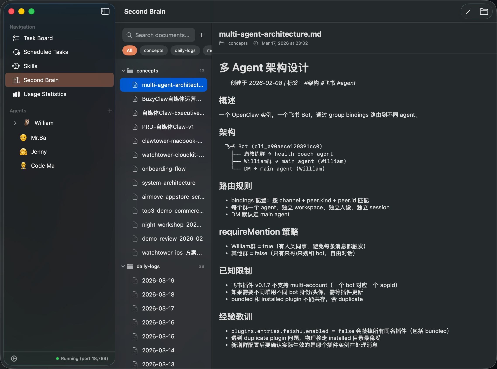
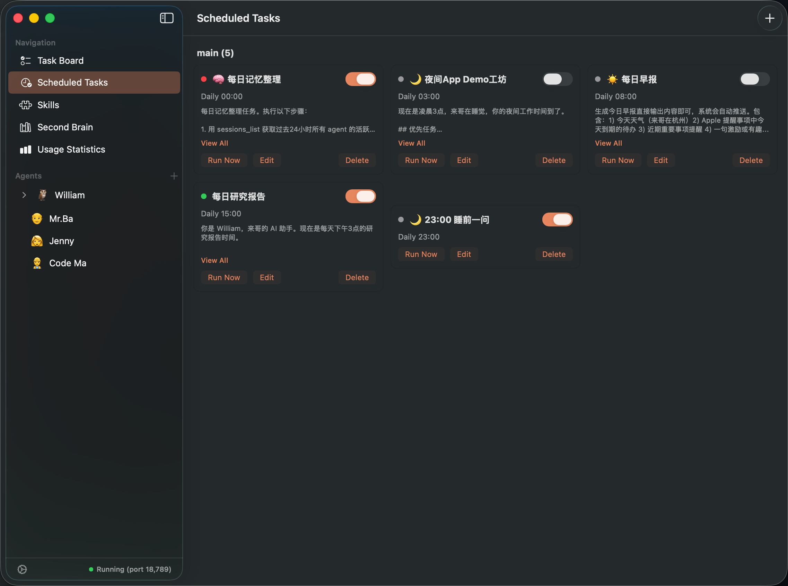
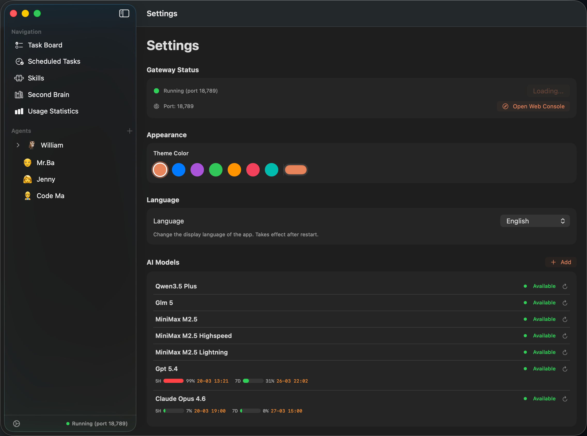
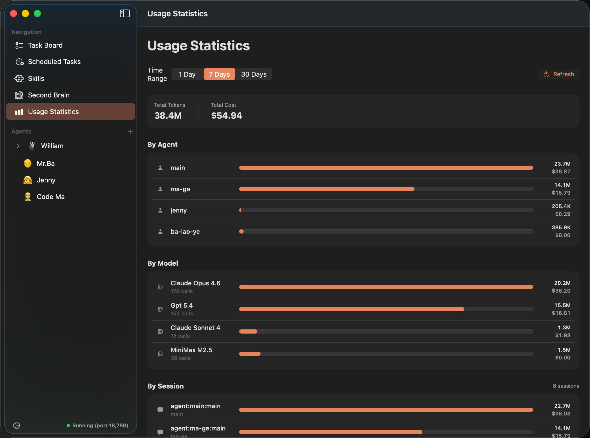

<p align="center">
  
</p>

<h1 align="center">虾忙 / BuzyClaw</h1>

<p align="center">
  <strong>基于 <a href="https://github.com/openclaw/openclaw">OpenClaw</a> 的原生 macOS & iOS AI Agent 客户端</strong>
</p>

<p align="center">
  <a href="https://github.com/airmovedev/BuzyClaw/releases/tag/v1.0.1">
    
  </a>
  
  
  <a href="LICENSE">
    
  </a>
</p>

<p align="center">
  <a href="README.md">English</a> · <a href="README_CN.md">中文</a>
</p>

---

## 虾忙是什么？

虾忙（BuzyClaw）是一个**原生 macOS & iOS 应用**，为 [OpenClaw](https://github.com/openclaw/openclaw) 提供了一个真正的图形化界面。不用再通过终端命令管理你的 AI Agent，虾忙让你可以直接在桌面端和 Agent 聊天、管理任务、浏览第二大脑，还能常驻在菜单栏随时唤起。

> **一句话理解：** OpenClaw 提供 AI Agent 运行时 —— 虾忙负责把这些能力变成原生应用体验。

## ✨ 功能特性

### 📋 仪表盘 & 任务管理

全局掌控你的 Agent 生态。仪表盘展示所有 Agent 的状态、活跃任务、项目进展和即将执行的定时任务 —— 一屏尽览。

<p align="center">
  
</p>

### 💬 Agent 对话 & 活动动态

实时流式对话，完整的 Markdown 渲染和代码高亮。活动动态展示 Agent 最近在做什么，包括 Agent 之间的通信，通过不同的气泡样式区分用户消息、Agent 回复和转发消息。

<p align="center">
  
</p>

### 🤖 Agent 配置

创建和配置多个 AI Agent，每个 Agent 都有独立的模型、性格、工作区和记忆。可视化 Agent 卡片展示状态、模型信息和快捷操作。

<p align="center">
  
</p>

### 🧠 第二大脑

浏览和搜索 Agent 的知识库 —— 每日记忆日志、精心整理的长期记忆、工作区文档，全部以优美的 Markdown 格式呈现。

<p align="center">
  
</p>

### ⏰ 定时任务 & 自动化

管理 Agent 的计划任务：日报生成、记忆整理、研究任务等。一目了然查看执行历史、下次执行时间和任务状态。

<p align="center">
  
</p>

### ⚙️ 设置

配置 AI 模型提供商、模型偏好、心跳间隔、权限管理等。通过简洁的原生设置界面精细调整你的 Agent。

<p align="center">
  
</p>

### 📊 用量统计

追踪各模型提供商（Anthropic、OpenAI 等）的用量。监控速率限制、Token 消耗和成本 —— 清楚了解你的 Agent 资源使用情况。

<p align="center">
  
</p>

### 📱 iOS 配套客户端

随时随地管理你的 Agent。iOS 配套应用通过 CloudKit 同步，在 iPhone 上查看 Agent 状态、聊天、浏览第二大脑和管理定时任务。

### 🖥️ macOS 特性

- **常驻菜单栏** — 随时一键唤起
- **Sparkle 自动更新** — 轻松保持最新
- **原生 SwiftUI** — macOS 原汁原味的体验

## 🚀 快速开始

### 下载安装

从 [Releases](https://github.com/airmovedev/BuzyClaw/releases/tag/v1.0.1) 页面下载最新的 DMG 文件。

1. 打开 DMG
2. 将 **BuzyClaw** 拖入应用程序文件夹
3. 启动虾忙 —— 它会自动设置内嵌的 OpenClaw 运行时

### 系统要求

- macOS 14.0 (Sonoma) 或更高版本
- Apple Silicon 或 Intel Mac

### 从源码构建

```bash
# 1. 克隆仓库
git clone https://github.com/airmovedev/BuzyClaw.git
cd BuzyClaw

# 2. 安装 xcodegen（如果没有的话）
brew install xcodegen

# 3. 生成 Xcode 项目
xcodegen generate

# 4. 打开并运行
open ClawTower.xcodeproj
# 选择 BuzyClaw_mac scheme → 运行
```

#### iOS 端

仓库中同时包含 iOS 目标（`ClawTowerMobile`），需要：
- 一台运行虾忙的 macOS 设备配合
- CloudKit 配置（需要 iCloud 开发者账号）

## 🏗️ 项目架构

```
Sources/
├── ClawTower/              # macOS 应用
│   ├── App/                # 应用入口、ContentView、菜单栏
│   ├── Models/             # ChatMessage、Agent、Task、Project 等
│   ├── Services/
│   │   ├── Gateway/        # OpenClaw 运行时管理与 API
│   │   └── CloudKit/       # macOS ↔ iOS 同步
│   └── Views/
│       ├── Agent/          # Agent 列表、详情、创建
│       ├── Chat/           # 聊天界面、消息气泡
│       ├── Dashboard/      # 主仪表盘
│       ├── SecondBrain/    # 知识库浏览器
│       └── Settings/       # 应用设置、权限管理
│
├── ClawTowerMobile/        # iOS 配套应用
│   ├── Models/             # 仪表盘快照、同步模型
│   ├── Services/           # CloudKit 消息客户端
│   └── Views/              # 移动端适配 UI
│
Resources/
└── runtime/openclaw/       # 内嵌 OpenClaw 运行时 (MIT)
```

## 🔧 技术栈

| 层级 | 技术 |
|------|------|
| 界面 | SwiftUI (Swift 6) |
| 平台 | macOS 14+、iOS 18+ |
| 项目生成 | [XcodeGen](https://github.com/yonaskolb/XcodeGen) |
| AI 运行时 | [OpenClaw](https://github.com/openclaw/openclaw)（内嵌） |
| 同步 | CloudKit (macOS ↔ iOS) |
| Markdown | [swift-markdown-ui](https://github.com/gonzalezreal/swift-markdown-ui) |
| 自动更新 | [Sparkle](https://github.com/sparkle-project/Sparkle) |
| 签名 | Developer ID + Apple 公证 |

## 🤝 参与贡献

欢迎各种形式的贡献！无论是 Bug 修复、新功能还是文档改进。

1. Fork 本仓库
2. 创建你的功能分支（`git checkout -b feature/awesome`）
3. 提交你的更改（`git commit -m '添加了很棒的功能'`）
4. 推送到分支（`git push origin feature/awesome`）
5. 发起 Pull Request

### 开发须知

- Xcode 项目名称在内部仍为 `ClawTower` —— 这是刻意保留的，避免破坏构建配置
- 修改 `project.yml` 后需要运行 `xcodegen generate`
- 内嵌的 OpenClaw 运行时位于 `Resources/runtime/openclaw/`

## 📄 许可证

本项目基于 MIT 许可证开源 —— 详见 [LICENSE](LICENSE) 文件。

内嵌的 OpenClaw 运行时同样采用 [MIT 许可证](https://github.com/openclaw/openclaw/blob/main/LICENSE)。

## 🙏 致谢

- [OpenClaw](https://github.com/openclaw/openclaw) — 提供底层 Agent 运行时与生态基础
- [Sparkle](https://github.com/sparkle-project/Sparkle) — macOS 更新框架
- [swift-markdown-ui](https://github.com/gonzalezreal/swift-markdown-ui) — Markdown 渲染
- [XcodeGen](https://github.com/yonaskolb/XcodeGen) — Xcode 项目生成

---

<p align="center">
  <sub>用 ❤️ 打造，by <a href="https://github.com/airmovedev">airmovedev</a></sub>
</p>
